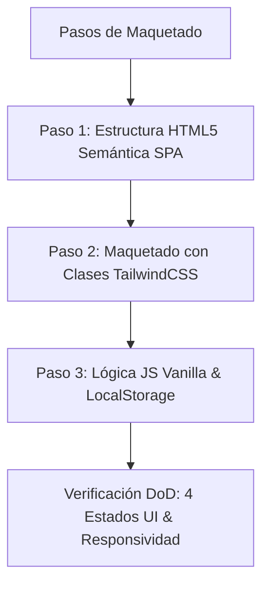

# Flujo de Trabajo SDD & Definition of Done - Cuotin

## 1. Ciclo de Desarrollo SDD (Software Design Document)
Seguimos la metodología SDD Adaptativa (basada en *Gentleman-Programming / gentle-ai*):
- **Fast-Path**: Si el cambio abarca 1 solo archivo y es menor, se aplica ejecución directa con verificación de calidad.
- **Ciclo SDD Completo**: Si el cambio abarca 2 o más archivos o implica arquitectura, se ejecuta:
  1. Investigación previa del codebase.
  2. Creación del Plan de Implementación (`implementation_plan.md`).
  3. Aprobación explícita del usuario.
  4. Ejecución del plan.
  5. Verificación e informe final (`walkthrough.md`).

## 2. Pasos de Maquetado y Construcción

## 3. Definition of Done (DoD)
Una tarea o función se da por concluida únicamente si cumple con:
1. **Justificación Técnica**: Razón clara de los cambios introducidos.
2. **Cero Errores**: Sin errores en la consola de JavaScript ni fallos de síntaxis.
3. **Verificación de 4 Estados UI**:
   - ⏳ **Loading**: Indicador visual o skeleton durante transiciones.
   - 📭 **Empty**: Estado explícito cuando el mes seleccionado no tiene gastos.
   - ❌ **Error**: Mensajes y validaciones amigables ante entradas inválidas.
   - ✅ **Success**: Despliegue correcto con animación y Toast verde.
4. **Código Limpio**: Aplicación de principios SOLID, DRY y legibilidad sin código redundante.
